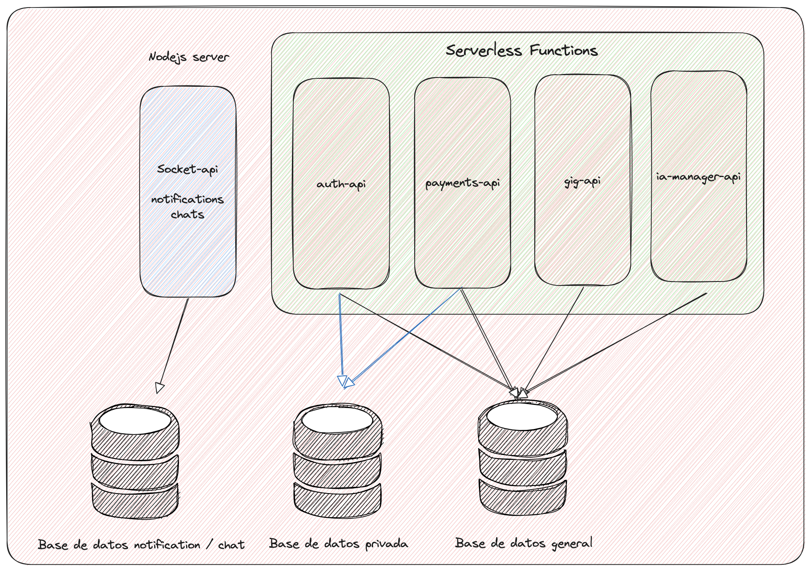

# ableai-mvp

## Description

**ableai-mvp** is a private monorepo project built with [Nx](https://nx.dev/) as the foundation for a production-ready application. The project is designed to serve as the base for a more complex system, following **Clean Architecture** principles and a **microservices architecture** to ensure clarity, extensibility, and a strong separation of concerns.

The project uses multiple databases to ensure clear separation of responsibilities and data privacy. There is a dedicated database for private user information, another for public user information, and a separate database specifically for notifications and chat data.

<div align="center">
  
</div>

## Tech Stack

- **Monorepo**: Nx
- **Backend**: Node.js, Express
- **Frontend**: React
- **Language**: TypeScript
- **Testing**: Jest
- **Code Quality**: ESLint, Prettier

## Project Structure

The project follows an architecture based on Nx monorepo,Clean Architecture and Microservices Architecture, organized as follows:

## `apps/`

Contains the main applications of the system. Each application has its entry point in `src/`. Examples:

* `apps/ai-manager-api/` — Handles interaction with AI service providers.
* `apps/auth-api/` — Issues tokens, manages refresh tokens, and handles user information.
* `apps/dashboard/` — Admin web application for system metrics and management.
* `apps/gig-api/` — Manages business logic for gig-workers and employers.
* `apps/payments-api/` — Handles integration with payment service providers.
* `apps/web-app/` — Main user-facing web application.
* `apps/socket-api/` — Manages real-time notifications and chat functionality.

## `libs/`

Contains reusable libraries and shared logic. Examples:

* `libs/backend/` — Backend logic not related to the domain.
* `libs/frontend/` — Frontend logic not related to the domain.
* `libs/models/` — Shared data models.
* `libs/product-domain/`

    Contains the domain logic, separated into backend and frontend:

    * `libs/product-domain/backend/` — Backend domain logic, including migrations organized by context and framework.
    * `libs/product-domain/frontend/` — Frontend domain logic.

    Example structure for backend domain migrations: `libs/product-domain/backend/[context]/infrastructure/[framework]/migrations/`

This organization promotes separation of responsibilities, scalability, and clarity in development.

## Deployment Workflow

The project uses GitHub Actions for continuous integration. On every pull request, the workflow defined in `.github/workflows/ci.yml` is triggered. This workflow checks out the code and runs basic scripts to ensure the repository is ready for deployment. You can extend this workflow to include build, test, and deployment steps as needed for your environment.

## Husky Integration

Husky is integrated into this repository to manage Git hooks. It helps enforce code quality by running scripts such as linters or tests automatically before commits and pushes. This ensures that only code meeting the project's standards is committed to the repository.

## Scripts

Below are some useful scripts for development and deployment:

### Serve a specific app

```sh
npx nx serve <app-name>
```
Example:
```sh
npx nx serve gig-api
```

### Build a specific project

```sh
npx nx build <app-name>
```
Example:
```sh
npx nx build gig-api
```

### Build all projects

```sh
npx nx run-many --target=build --all
```

### Serve all apps

```sh
npx nx run-many --target=serve --all
```

These are the available scripts to generate backend domain migrations using Drizzle Kit:

- **Generate migration for gig**  

Run:

```sh
    npx nx run product-domain/backend:generate-gig-migration
```

- **Generate migration for private_gig**

Run:

```sh
    npx nx run product-domain/backend:generate-private-gig-migration
```

